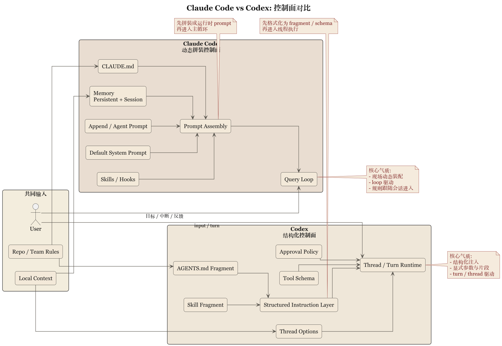

# 第 2 章 两种控制面：Prompt 拼装与 Instruction Fragment



## 2.1 控制面这件事，首先不是文风问题

谈 prompt 最容易落到文风上，仿佛系统控制的核心是把一段文字写得更像老工程师——这有点像把警察制度理解成说话语气。Claude Code 和 Codex 都不这么看，它们都把面向模型的指令当作行为控制的一部分，只是实现方式不同。Claude Code 采用层层拼装：`constants/prompts.ts`、`utils/systemPrompt.ts`、`claudemd.ts`、memory 与 output style 按运行时条件注入到 system prompt 里，重点不是文案而是多个来源如何排优先级、避免互相打架。Codex 则是结构化片段：`instructions/src/fragment.rs` 定义 `AGENTS.md` 和 skill 的 fragment 标记，`user_instructions.rs` 把用户指令序列化成带目录和边界标记的消息——instruction 不是随意串接的自由文本，而是"有开始、有结束、有来源类型"的上下文单元。

## 2.2 Claude Code 的控制面是动态装配线

Claude Code 的 system prompt 有一个朴素前提：控制面会随着任务、memory、工具能力和团队注入而变化，不是固定文本。因此它是装配线——默认 prompt 做底板，append prompt 加要求，agent prompt 补角色，`CLAUDE.md` 和 memory 带现场条件。好处是同一主循环适配多场景；代价是必须在乎装配顺序，否则层层叠加容易互相覆盖、语义稀释。也因此它很依赖运行时的 prompt 治理——控制面是不断被注入、覆盖、折叠和压缩的动态组合物，而非静止法规。这与 loop 性格相配：每轮都要重新计算"现在什么最重要"。

## 2.3 Codex 的控制面是带编号的公文系统

Codex 正相反——它不愿让 instruction 只是"模型自己体会"的自由文本。`ContextualUserFragmentDefinition` 这命名已相当直白：强调片段类型、起止边界、包裹规则和消息转换。一段本地规则不只是"有内容"，还必须能被识别为某一类内容：`AGENTS.md` 是明确的 fragment，skill 是明确包裹过的上下文单元。

这不是概念层面的漂亮命名。`fragment.rs` 把 `AGENTS_MD_START_MARKER` / `AGENTS_MD_END_MARKER` / `SKILL_OPEN_TAG` / `SKILL_CLOSE_TAG` 定成常量，由 `ContextualUserFragmentDefinition::wrap()` 和 `into_message()` 包装成 `ResponseItem::Message`。`user_instructions.rs` 里 `UserInstructions` 把目录序列化成 `# AGENTS.md instructions for ...`，`SkillInstructions` 还带 `<name>` 和 `<path>`。Codex 连"这段规则来自哪个目录、哪个 skill 文件"都不让模型猜。

直接后果：控制面可调试性更强——哪段内容来自哪里一目了然；也更适合继续程序化——今天是 marker，明天就可能细化为 precedence、merge rule 或 visibility rule。

### 骨架：两种控制面装配 (skeleton)

```
// 骨架: Claude Code 动态拼装  (源: constants/prompts.ts, utils/systemPrompt.ts, claudemd.ts)
system_prompt = concat(
    default_prompt,           // 底板
    append_prompt,            // 外加
    agent_prompt,             // 角色
    claudemd_layers,          // team / personal / project
    memory_sections,          // session memory
    output_style              // 表达约束
)
// 运行时每轮重算：memory 预取、collapse、microcompact、autocompact

// 骨架: Codex fragment 拼装  (源: instructions/src/fragment.rs, user_instructions.rs)
for frag in [agents_md, skill, user_instructions]:
    body = ContextualUserFragmentDefinition::wrap(
        START_MARKER, content, END_MARKER,
        meta { source_dir, name, path }
    )
    msg  = frag.into_message()              // -> ResponseItem::Message
    thread.append(msg)
```

### 不变式 (invariants)

```
assert every fragment has matching (START_MARKER, END_MARKER)   # marker 成对
assert fragment.source ∈ {AGENTS_MD, SKILL, USER}              # 类型可识别
assert precedence(project) > precedence(team) > precedence(default)  # 优先级单调
assert claudemd_layers 覆盖顺序 = team → personal → project     # 后注入覆盖前注入
assert child_agents_md enabled ⇒ 附加 scope/precedence 说明     # 作用域显式
```

## 2.4 AGENTS.md 与 CLAUDE.md：同样是本地规则，气质却不同

`CLAUDE.md` 更接近工程现场公告板：贴近任务目录、和 memory/skill 一起构成"做事时该记住什么"，适合登记常识、禁忌与局部制度。`AGENTS.md` 则被 Codex 拉进 hierarchy 讨论——`docs/agents_md.md` 明确说，即便当前没有 `AGENTS.md`，开启 `child_agents_md` 时系统也会追加作用域与优先级说明。Codex 关心的不只是"有没有规则"，还包括"规则的适用范围和继承关系有没有被系统明说"。

一句话：Claude Code 让现场规则进入会话，Codex 让现场规则进入制度。

## 2.5 两种控制面的代价

运行时装配线灵活但难以彻底形式化，依赖主循环和工程经验，规则一多就要防互相覆盖和语义稀释。结构化片段更显式但更重：marker、类型、序列化和注入方式都要定义，还得区分谁是一等对象。前者养出经验型控制力，后者养出制度型控制力——一个长于灵活但不够显式，一个长于清楚但要持续维护结构成本。

## 2.6 这章的比较结论

> Claude Code 把 prompt 视为运行时控制面的动态拼装结果，Codex 把 instruction 视为可识别、可包裹、可序列化的结构化片段。

前者更像现场编导，后者更像制度秘书。谁更先进这问题没意义——真正要看的是系统更怕哪种失控：怕长会话指令失真、现场变化太快，欣赏 Claude Code 的动态装配；怕规则来源不清、作用域模糊、无法系统化治理，欣赏 Codex 的 fragment 化。下一章谈更深的分野：连续性究竟寄托在 query loop，还是寄托在 thread、rollout 和 state 这些更显式的结构上。
