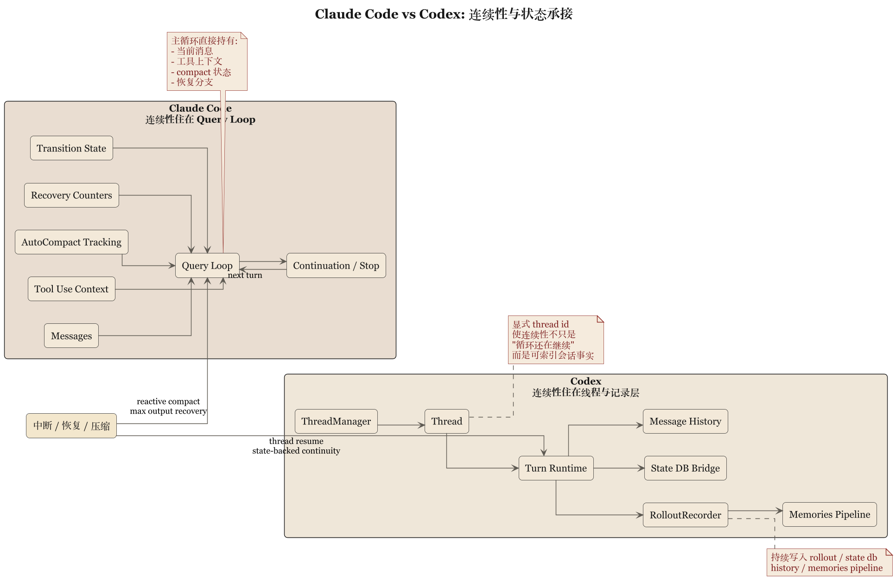

# 第 3 章 心跳放在哪：Query Loop 对照 Thread、Rollout 与 State



## 3.1 代理系统的核心是连续性

把代理系统当成“多轮聊天”，就像把数据库当成“一个比较耐心的记事本”——掩盖了真正的架构难题。代理系统真正难的是连续性：上一轮做了什么这一轮怎么接、工具结果怎么回填、中断后怎么收口、上下文过长怎么整理、失败时要重试还是忠实汇报。这些问题决定系统是不是 agent，而不只是某个”支持工具调用的问答接口”。Claude Code 与 Codex 在这里的差异，比任何功能对照都更有含金量。

## 3.2 Claude Code：把连续性压进主循环

Claude Code 的主轴就在 `query()` 和 `queryLoop()` 一带。它把很多关键问题都压进循环状态里：当前消息序列、tool use context、compact 跟踪、output token 恢复计数、pending summary、turn count、transition。也就是说，对"代理如何活着"的回答是运行时性的——连续性主要由 loop 维护，系统骨架是一个不断自我校正的会话发动机，而非先有强外部状态模型再驱动执行的体系。优势很现实：工具返回顺序、输出截断、prompt too long、history snip、microcompact、用户插话，这些真实麻烦都发生在 loop 里。它不回避这些问题，而把它们当作 loop 内部的合法状态。设计有工程的粗粝感——不优雅但通常更稳。

## 3.3 Codex：把连续性拆成线程、rollout 与状态桥

Codex 更"账本化"。`core/src/lib.rs` 里连续性被分摊到 `codex_thread`、`thread_manager`、`rollout`、`state_db_bridge`、`state`、`message_history`。


`sdk/typescript/src/thread.ts` 里 thread 已经是外部开发者可直接操作的一级概念：`Thread` 持 `id`，可 `runStreamed()` 或 `run()`，`thread.started` 回填线程 ID；approval policy、working directory、sandbox mode、network access、additional directories 等 turn 级条件都是紧耦合显式参数。"线程主权"很具体——`runStreamedInternal()` 先做 `normalizeInput()` 分离文本和图像，调 `createOutputSchemaFile()` 备 schema，再把 `threadId`、`approvalPolicy`、`sandboxMode`、`workingDirectory`、`networkAccessEnabled`、`additionalDirectories` 一并送进 `_exec.run()`。收到 `thread.started` 事件，对象即更新 `_id`。thread 不是外围包装，是 turn 级执行语义真正经过的一层。连续性不再只是"循环还在继续"，而是"一个线程被一套显式状态结构持续记录和约束"。rollout 的存在尤其说明 Codex 在乎回放、索引、持久化和会话外可见性——系统因此更接近执行记录器，而非现场对话管理器。

## 3.4 差别在于状态安放的位置

Claude Code 当然有状态，Codex 当然有循环——差异不在有没有，而在主权在哪。Claude Code 把状态主权更多交给 query loop：系统认为"会话怎么继续"是 runtime 核心问题，许多事情要在 loop 里直接解决。Codex 把状态主权更明确地交给 thread 和 rollout 结构：连续性不该是内部控制流的副产物，而是被线程和状态基础设施承接的显式事实。因此 `Thread` 在 TypeScript SDK 里已是产品概念，开发者直接围绕它思考 agent turn；Claude Code 的 query loop 则更像发动机室，重要但不一定是用户心智模型的中心。

### 不变式：连续性主权 (invariants)

```
// Claude Code (源: src/query.ts)
assert loop owns {messages, toolUseContext, compactTracking, turnCount}
assert every loop iteration recomputes "what matters now"
assert pending tool_use 在同一 loop iteration 内必须被闭合或 synthetic 兜底

// Codex (源: core/src/lib.rs, sdk/typescript/src/thread.ts)
assert thread.id is stable across runs; rollout records every turn
assert turn-level {approvalPolicy, sandboxMode, workingDirectory} 在 exec.run() 入参中显式
assert thread.started 事件先于任何工具调用 emitted
assert state_db_bridge 持久化早于主循环退出
```

### 中断与 pending tool_use 的故障矩阵

| 事件顺序 | 前置状态 | 触发 | Claude Code 下一步 | Codex 下一步 |
|---|---|---|---|---|
| 用户中断 + 工具在飞 | tool_use 未闭合 | 用户 abort | 在 loop 内 synthesize tool_result，闭账 | 线程层 abort，写 rollout interrupted 事件 |
| 模型输出被截断 | max_output_tokens | 上限触发 | 提升 cap 或追加 meta user msg 续写 | 线程记录 truncation，由 caller 重启 turn |
| prompt too long | 会话过胀 | `prompt_too_long` | loop 内 collapse / reactive compact / surface | 由 thread_manager 裁剪 history 再下一轮 |
| 进程重启 | 会话中途崩溃 | crash / kill | 依赖外部 PR / Git 重建，loop 状态易丢 | rollout + state_db_bridge 可按 thread.id 重放 |
| 恢复失败 | 连续 compact 失败 | 熔断阈值 | 跳过 stop hook，faithful 报错 | 返回 state bridge 错误，保留 thread 记录 |

## 3.5 对恢复与可审计性的影响

状态安放差异直接影响恢复和审计。Claude Code 的恢复强项在离现场近——很多问题就在 loop 内部被发现和修复（reactive compact、token 上限恢复、工具中断处理），不需要先搬运到更高一层状态模型里再考虑怎么回滚。Codex 的恢复强项体现在状态可追踪性——线程有 ID，rollout 有记录，state bridge 和 message history 提供更清楚的外部结构，系统更容易回答"上一轮到底发生了什么"。`core/src/lib.rs` 的"档案意识"更明显：不只暴露 `CodexThread`，还显式导出 `ThreadManager`、`RolloutRecorder`、`state_db_bridge` 和 `message_history`——一个系统把这些器官放到根模块出口附近，等于承认连续性不是 loop 的副产品而是基础设施本身。简言之：Claude Code 像现场救火队，Codex 像带档案系统的调度中心；前者擅长维持运行，后者擅长说清楚运行是如何被维持的。

## 3.6 对产品和团队接口的影响

主权在 loop，团队沿运行时问题组织工作：哪些错误需要恢复、哪些动作应当中断、compact 何时触发、工具结果如何串回主对话。主权在线程和状态结构，团队沿接口与治理组织工作：thread 的生命周期、rollout 保留哪些事件、状态库放哪、approval policy 如何成为 turn 级选项。因此 Claude Code 更像先把 agent 做会再嵌制度，Codex 更像先立制度接口再让 agent 在里面工作。

## 3.7 本章结论

这一章的结论可以写得明确一点：

> Claude Code 的连续性更多由 query loop 承担，Codex 的连续性更多由 thread、rollout 与 state 基础设施承担。

前者强调 runtime heartbeat。

后者强调 persisted session substrate。

这不是审美差异，这是系统权力分配。谁来拥有连续性，谁就定义了 harness 的中心。

下一章进入最硬的一层：工具、沙箱、审批和执行策略。到了这里，浪漫叙事一般都会自动退场，因为 shell 不大关心文风。
