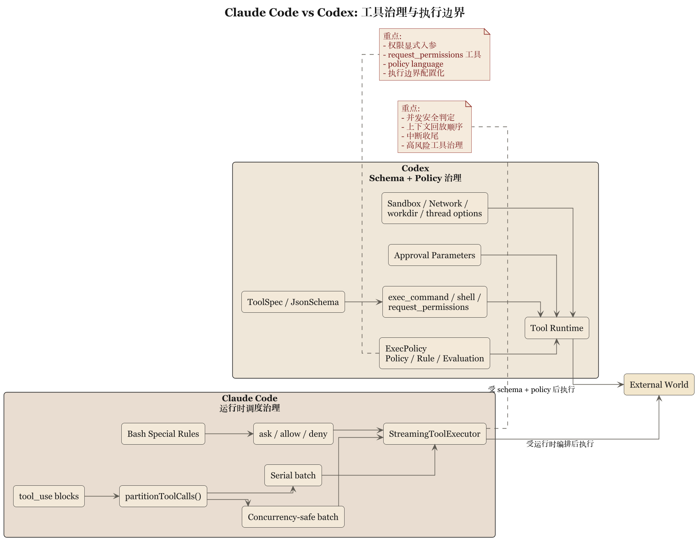

# 第 4 章 工具、沙箱与策略语言：谁来阻止模型动手太快



## 4.1 真正危险的是开始执行

模型说错话只浪费时间，跑错命令就可能把目录、仓库、进程和工作流一起带坏。真正把 AI coding system 区分开来的，是调工具之前谁拥有最后解释权。Claude Code 和 Codex 都很认真，但认真得不一样：前者在运行时把工具纳入调度纪律——`toolOrchestration.ts`、`toolExecution.ts`、`StreamingToolExecutor.ts`、`useCanUseTool.tsx`、Bash 专门 prompt 和 allow/deny/ask 语义，关心的是能不能跑、怎么跑、能不能并发、用户有没有拒绝、如何中断、结果怎么回到上下文。后者把工具本身做成类型化接口——`tools/src/lib.rs` 导出工具构造器，`local_tool.rs` 定义 `exec_command`、`shell`、`shell_command`、`request_permissions` 等 schema。工具在 Codex 里首先是规范化 API，其次才是执行单元。

## 4.2 Claude Code：重点在运行时编排和危险动作约束

Claude Code 的工具系统有强烈现场调度感：并发看 schema 和 `isConcurrencySafe()`，上下文修改要保证回放顺序稳定，流式执行还要处理中断、synthetic result 和 UI 反馈。它承认工具调用是"一个带后果的过程"而非单点动作——像给模型装工地监工：先做哪个、哪些能并行、哪些串行、做完怎么记账、中途被叫停怎么办。对 Bash 这类高风险工具的唠叨，正是成熟工程对危险接口的态度。

## 4.3 Codex：重点在工具 schema、审批参数和策略引擎

Codex 把"风险动作"的控制做成正式接口约束。`local_tool.rs` 里 `exec_command` 显式拥有 `cmd`、`workdir`、`shell`、`tty`、`yield_time_ms`、`max_output_tokens`、`login` 和 approval 相关字段——不是接收一个字符串命令了事；`shell` / `shell_command` 描述层直接要求设 `workdir`、提醒别滥用 `cd`。正确使用方式被嵌进工具定义本身。审批和权限提升抽成显式参数，`request_permissions` 做成单独工具，`execpolicy` 单独做成 crate——`Policy`、`Rule`、`Evaluation`、`Decision`、parser 这套命名等于说：执行边界已经是一门小型政策语言，不只是几个 if/else。而这不是虚张：schema required 字段明确、`additional_properties` 关闭；`execpolicy/src/lib.rs` 不仅导出 parser 和 `PolicyParser`，还导出 `blocking_append_allow_prefix_rule`、`blocking_append_network_rule` 这种修正 helper——Codex 不只检查政策，还准备了修改和补丁的正式入口。

## 4.4 运行时审批对照策略语言

Claude Code 偏运行时审批链，Codex 偏显式策略语言与参数化审批。Claude Code 的 ask/allow/deny 与调用现场紧密耦合，按上下文、工具类型、用户动作和会话状态决定，长处是灵敏，缺点是规则容易藏在 runtime 逻辑里。Codex 的 exec policy 把规则抽离，可单独解析和评估，长处是可读性和可迁移性更强，适合团队治理，缺点是系统更重，policy 设计必须当正事维护。直说：前者像"值班经理现场拍板"，后者像"公司先写好制度，再看这单是否合规"。

### 骨架：两种风险闸门 (skeleton)

```
// 骨架: Claude Code 运行时审批  (源: src/hooks/useCanUseTool.tsx, StreamingToolExecutor.ts)
decision = hasPermissionsToUseTool(tool, input, ctx)  // allow | deny | ask
match decision:
    allow: schedule_with_concurrency_check(tool)       // isConcurrencySafe()
    deny:  reject(reason)                              // sticky
    ask:   route_to(coordinator | swarm | interactive)
interrupt_semantics = tool.interruptBehavior ∈ {cancel, block}

// 骨架: Codex exec-policy 评估  (源: execpolicy/src/lib.rs, local_tool.rs)
policy = PolicyParser.parse(source)
for rule in policy.rules:
    eval = rule.evaluate(exec_command { cmd, workdir, shell, tty,
                                         yield_time_ms, max_output_tokens, login })
    if eval.matches: return Decision::{Allow | Deny | RequestPermissions}
return Decision::default
```

### 审批决策树

```
tool_call
  ├─ schema 校验失败            → deny（additional_properties=false 阻止乱塞）
  ├─ 高危前缀匹配 deny rule     → deny
  ├─ 网络/提权 匹配 ask rule    → request_permissions（显式工具）
  ├─ 无匹配 & sandbox 可覆盖    → allow（受 workdir/sandbox mode 约束）
  └─ 无匹配 & sandbox 保守       → ask
```

### 超时与参数阈值

| 名称 | 含义 | 源引用 |
|---|---|---|
| `yield_time_ms` | 单次 exec 允许阻塞的毫秒上限 | `local_tool.rs (exec_command)` |
| `max_output_tokens` | 工具输出纳入上下文的 token 上限 | `local_tool.rs` |
| `additional_properties=false` | 阻止模型乱塞参数 | `local_tool.rs (schema)` |
| Bash 子命令数 cap | 单次 Bash 调用允许的复合子命令上限 | `bashPermissions.ts` |

## 4.5 沙箱与审批：产品定义问题

沙箱、审批、权限不是安全附属件——对 coding agent 而言，它们定义了产品是什么。系统若允许模型在用户目录直接跑任意命令，就把风险转嫁给了用户；反过来，能显式表达 sandbox mode、network access、approval policy、additional directories、state DB 位置和 MCP tool approvals，才是同时交付能力与行为边界。Codex 把 turn 级条件暴露在 `thread.ts` 里，视之为线程语义；Claude Code 把边界压到运行时现场——工具执行、中断、permission hook 与 Bash 限制。一个"边做边看守"，一个"先给出执行契约再开始做"。

## 4.6 MCP、扩展工具与边界外移

两套系统都能接外部能力，但差异仍在。Claude Code 把 skill / hook / permission / 工具 prompt 拼成场景化治理链，让本地规则跟着现场进主循环；Codex 则把外部能力统一纳入工具系统——`tools/src/lib.rs` 的 MCP resource、dynamic tool、tool discovery 说明扩展也应是 schema 化、公理化的工具对象，而非临时约定。生态一旦变大，"扩展能力如何服从总规则"就成了压舱石：谁先想清楚边界外移，谁的扩展体系就不会变成杂物间。

## 4.7 本章结论

这一章可以压缩成一句比较硬的判断：

> Claude Code 的工具治理更强地依赖运行时编排与现场审批，Codex 的工具治理更强地依赖 schema、参数化权限和独立策略系统。

前者像经验丰富的工头。

后者像有制度处和法务部的施工单位。

你要是只看“都能跑命令”，就会错过真正重要的差异。重要的是，谁在工具动手之前拥有最终秩序。

下一章看更接地气的一层：skills、hooks、本地规则文件和团队制度。技术系统一旦要进团队，最后都得学会写村规民约。
