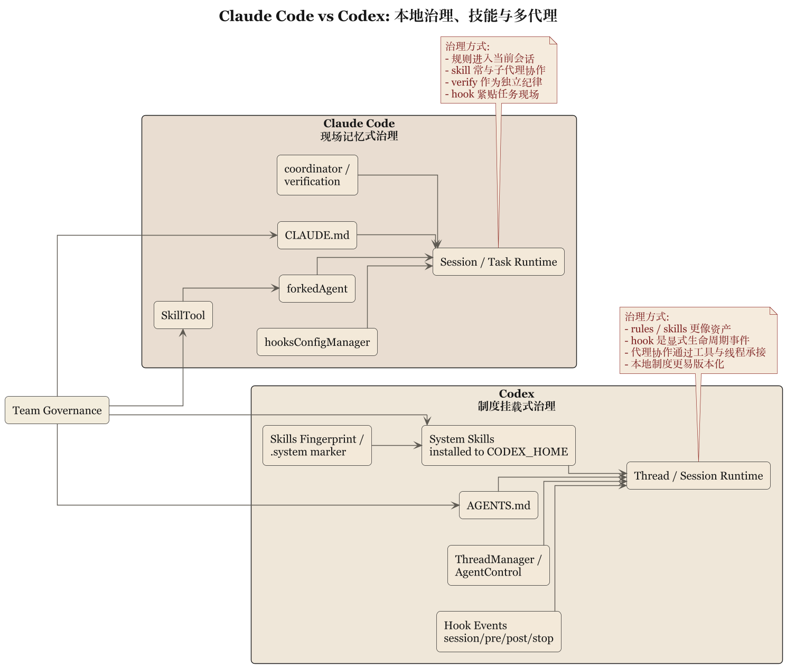

# 第 5 章 技能、Hook 与本地规则：系统如何学会守乡约



## 5.1 真正能落地的 agent，一定会地方化

任何通用 coding agent 一旦开始给团队干活，就遇到同一问题：公司有公司规矩，仓库有仓库规矩，目录有目录规矩，人还有怪脾气。系统不能吸收这些局部制度，就只能停在演示环境里。Claude Code 和 Codex 都给出答案，方向不同。

## 5.2 Claude Code：把局部制度做成现场记忆

地方化能力落在 `CLAUDE.md`、skill、hook、session memory——组合起来有"现场经验沉淀"味道：`CLAUDE.md` 说清此仓库/目录/团队的常识，skill 打包工作流，hook 挂生命周期，session memory 让当前工作不必每轮重新做人。共同特点是贴近任务现场——让规则进入当前会话、参与当前执行，而不是先定义万古不变的制度。像一个随身带笔记本的工程师，走到哪把当地规矩抄下来：很实用，适合多项目多目录多约束并存，但没额外整理的话知识容易以"现场补丁"扩张。

## 5.3 Codex：把局部制度做成结构化注入和事件系统

Codex 也有 skill、本地规则、hook，但更制度化。skill：`skills/src/lib.rs` 把 system skills 装到 `CODEX_HOME/skills/.system` 并做 fingerprint——skill 不是临时读入的文本，而是被安装、被管理、可追踪版本的资产。`install_system_skills()` 比对 fingerprint，仅 marker 不匹配时才覆写。`AGENTS.md` 不只是"读一份本地说明"，还伴随作用域和 hierarchy 讨论——局部规则不只是内容，还带位置关系。hook：`hooks/src/engine/mod.rs` 把事件拆成 `session_start`、`pre_tool_use`、`post_tool_use`、`user_prompt_submit`、`stop`，每个 handler 都有 `event_name`、matcher、timeout、status message、source path、display order——接近显式生命周期事件系统。engine 还分 `preview_*` / `run_*` 两条路径（先预览再执行），Windows 上因能力不完整明确关闭 `codex_hooks` 并返回 warning——hook 能不能开、为什么不开，都希望可解释。

## 5.4 Claude Code 偏经验收编，Codex 偏制度挂载

Claude Code 的本地治理把现场经验不断收编进主循环附近，擅长让 agent 在当前上下文里迅速学会"这里怎么办事"；Codex 把地方规则挂载到明确控制面与生命周期机制上，擅长让规则被分类、排序、安装、触发。团队感也就不同：前者像熟悉现场、懂看气氛的老员工，后者像制度意识极强的新项目经理——先把规则贴出来再协调人做事。

### 骨架：Codex hook 生命周期 (skeleton)

```
// 骨架: Codex hook engine  (源: hooks/src/engine/mod.rs)
events = [session_start, user_prompt_submit, pre_tool_use, post_tool_use, stop]
for ev in events:
    handlers = preview_handlers(ev, ctx)        // 先预览命中
    emit(preview_event { ev, handlers })
    for h in handlers sorted by display_order:
        if match(h.matcher, ctx) and not timed_out(h.timeout):
            run_handler(h)                      // 真正触发
        else:
            log_skip(h, reason)
on platform == windows: disable(codex_hooks); warn("incomplete support")
```

### 不变式：hook 事件顺序

```
assert session_start fires once per thread before any tool_use
assert pre_tool_use fires immediately before execution; post_tool_use after
assert stop fires exactly once per thread termination path
assert preview_* path never executes handlers; only run_* does
assert each handler has {event_name, matcher, timeout, source_path, display_order}
assert display_order 稳定 ⇒ 同一事件下多 handler 可重放
assert skill fingerprint 不匹配 ⇒ 触发重装；匹配则跳过  (skills/src/lib.rs)
```

## 5.5 对组织可复制性的影响

主要靠现场经验注入的系统，适应新仓库更快、在复杂局部语境中更有效；但复制到更多团队时需要额外整理，否则各写各的 `CLAUDE.md`、各做各的 skill，像各省自印教材。主要靠结构化注入和事件挂载的系统，在组织扩展上更有潜力——规则易统一分发、版本化和审计；代价是学习成本更高，团队要先接受更多显式制度。经典取舍：越贴近现场越有弹性，越制度化越易复制。真正决定结果的，是团队需要哪一种稳定性。

## 5.6 本章结论

这一章的归纳可以写成：

> Claude Code 更倾向于把局部治理做成现场记忆与运行时注入，Codex 更倾向于把局部治理做成结构化资产与生命周期事件系统。

这不是“都支持 skills 和 hooks”的同义反复。

差别在于，Claude Code 问的是“怎样让 agent 在这里干活更像本地人”，Codex 问的是“怎样让本地规则进入一套可管理的制度框架”。

下一章要看这两种系统在更高风险处如何分工：多代理、验证、持久状态和恢复。系统一旦开始让多个代理干活，光讲规矩还不够，还得讲责任分离。
